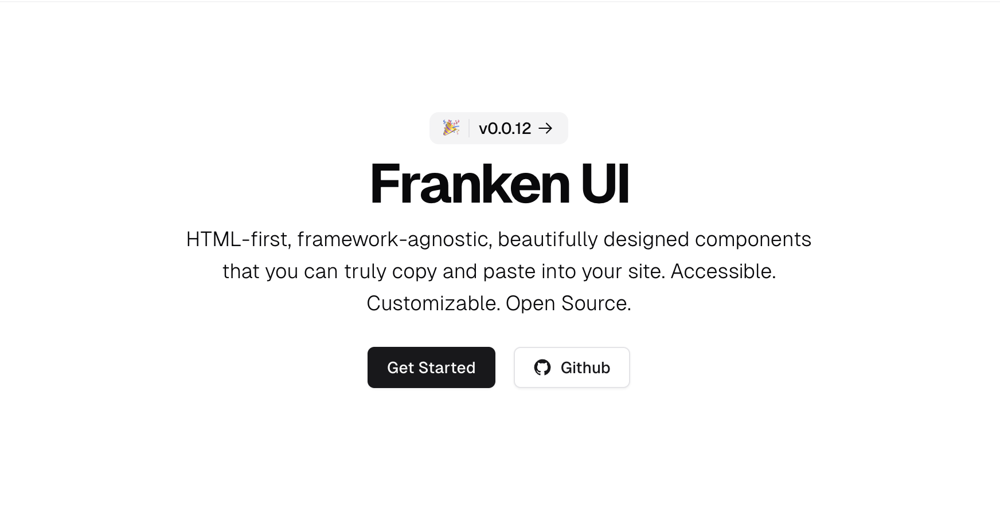

 

  

  <h3 align="center">Franken UI Templ</h3>

  

    A Go Templ port of <a href="https://github.com/sveltecult/franken-ui">Franken UI</a>
     
     
    <a href="https://github.com/yzaimoglu/franken-ui/issues">Report Bug</a>
    .
    <a href="https://github.com/yzaimoglu/franken-ui/issues">Request Feature</a>
  

  

## Table Of Contents

* [About the Project](#about-the-project)
* [Built With](#built-with)
* [Getting Started](#getting-started)
  * [Prerequisites](#prerequisites)
* [Roadmap](#roadmap)
* [Contributing](#contributing)
* [License](#license)
* [Acknowledgements](#acknowledgements)

## About The Project

## Built With

We are using [Go](https://go.dev), [Templ](https://templ.guide/), [Tailwind](https://tailwindcss.com/) and [Franken-UI](https://github.com/sveltecult/franken-ui).

## Getting Started

Make sure to follow the instructions on the Franken UI page to install UIKit and Franken UI, as well as Tailwind with PostCSS.

### Prerequisites

These are prerequisites to help with the development of this library.

* make
* go 
* npm
* wgo
* templ

## Roadmap

See the [open issues](https://github.com/yzaimoglu/franken-ui/issues) for a list of proposed features (and known issues).

## Contributing

We appreciate everyone who wants to contribute. In order to do so take a look at the issues tab and work on one of the issues. You can then create a pull request:

### Creating A Pull Request

1. Fork the Project
2. Create your Component Branch (`git checkout -b component/AmazingComponent`)
3. Commit your Changes (`git commit -m 'Add some AmazingComponent'`)
4. Push to the Branch (`git push origin component/AmazingComponent`)
5. Open a Pull Request

## License

Distributed under the MIT License. See [LICENSE](https://github.com/yzaimoglu/franken-ui/blob/master/LICENSE) for more information.

## Acknowledgements

* [Go](https://go.dev)
* [Templ](https://templ.guide)
* [Tailwind](https://tailwindcss.com/)
* [Franken-UI](https://github.com/sveltecult/franken-ui)
* [Gopherize Me](https://gopherize.me/)
